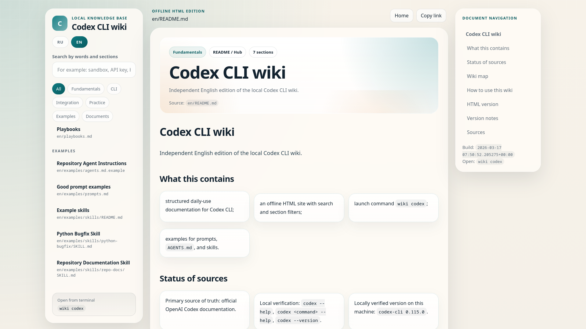

<p align="center">
  
  
  
  
  
</p>

<h1 align="center" style="font-size:60px;">Codex CLI Wiki</h1>

<p align="center">

</p>

## Codex CLI Wiki

Structured documentation for daily work with Codex CLI, deployed as a searchable web site.

**Live site:** https://milord-x.github.io/Codex-CLI-Wiki/

- **RU:** https://milord-x.github.io/Codex-CLI-Wiki/#lang=ru
- **EN:** https://milord-x.github.io/Codex-CLI-Wiki/#lang=en

## What's inside

- Structured Codex CLI documentation in Russian
- Full English translation in `en/`
- Interactive HTML site with search by keywords and sections
- Examples of prompts, `AGENTS.md`, and skills
- Ready-to-use workflows and playbooks

## Repository structure

```
/
├── *.md              # Russian documentation (main)
├── en/               # English translation
├── examples/          # Prompts, AGENTS.md, skills
├── tools/            # Site generator
├── .github/workflows/ # GitHub Pages deployment
├── LICENSE           # MIT license
└── README.md         # This file
```

## Quick navigation

| # | File | Description |
|---|------|-------------|
| 01 | [01-installation.md](./01-installation.md) | Installation |
| 02 | [02-auth-and-plans.md](./02-auth-and-plans.md) | Authentication |
| 03 | [03-basic-commands.md](./03-basic-commands.md) | Basic commands |
| 04 | [04-interactive-workflow.md](./04-interactive-workflow.md) | Interactive workflow |
| 05 | [05-command-reference.md](./05-command-reference.md) | Command reference |
| 06 | [06-config.md](./06-config.md) | Configuration |
| 07 | [07-models-and-modes.md](./07-models-and-modes.md) | Models and modes |
| 08 | [08-skills.md](./08-skills.md) | Skills |
| 09 | [09-agents-md.md](./09-agents-md.md) | AGENTS.md |
| 10 | [10-best-practices.md](./10-best-practices.md) | Best practices |
| 11 | [11-prompting.md](./11-prompting.md) | Prompting |
| 12 | [12-debugging-recovery.md](./12-debugging-recovery.md) | Debugging |
| 13 | [13-anti-patterns.md](./13-anti-patterns.md) | Anti-patterns |
| - | [cheatsheet.md](./cheatsheet.md) | Quick reference |
| - | [playbooks.md](./playbooks.md) | Workflows |
| - | [INDEX.md](./INDEX.md) | Full index |

## How to use this wiki

1. **New to Codex CLI?** Start with `01-installation.md` and `02-auth-and-plans.md`
2. **Already installed?** Read `03-basic-commands.md`, `04-interactive-workflow.md`, `05-command-reference.md`, `06-config.md`
3. **Daily work:** Keep `cheatsheet.md` nearby
4. **Project tasks:** Use `playbooks.md` and `examples/prompts.md`
5. **Before risky runs:** Check `05-command-reference.md` and `07-models-and-modes.md`

## Building the site locally

```bash
git clone https://github.com/milord-x/Codex-CLI-Wiki.git
cd Codex-CLI-Wiki
python3 tools/build_site.py
```

Open `site/index.html` in your browser.

## Independence and trademarks

- This is an independent unofficial project
- Not affiliated with, endorsed by, or sponsored by OpenAI
- OpenAI, ChatGPT, GPT, and Codex are trademarks of their respective owners
- If you fork or create derivative work, do not imply it is official

## Sources

- Official Codex documentation: https://developers.openai.com/codex
- Codex authentication: https://developers.openai.com/codex/auth
- Local verification: `codex --help`, `codex <command> --help`, `codex --version`

> Documentation may differ between versions. In ambiguous cases, trust `codex --help` from your installed version first.
